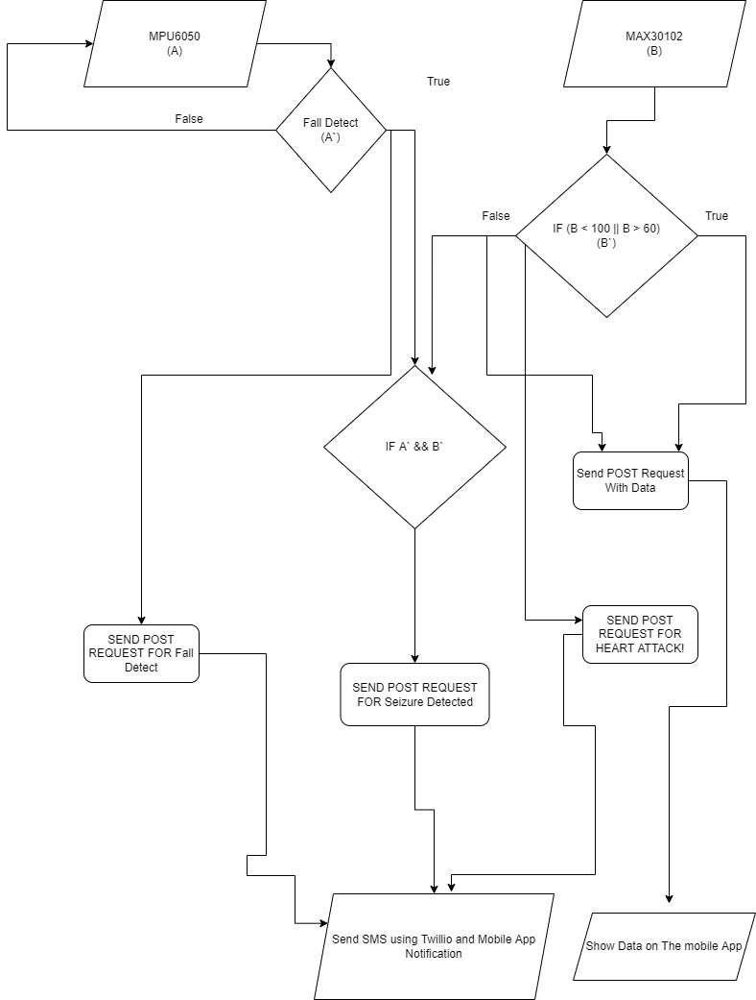
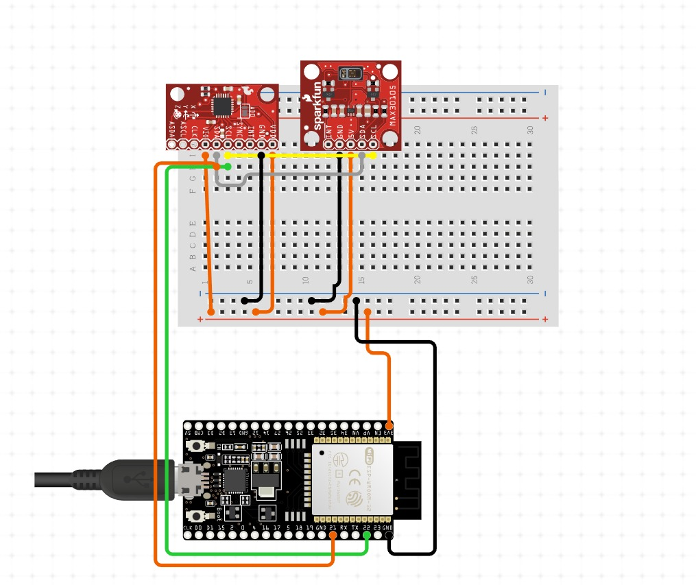
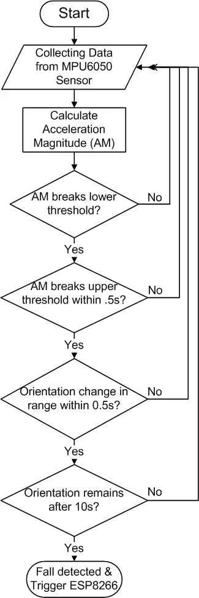

# Seizure-Detection

## Introduction
This project aims to build a monitoring system that tracks heart rate, detects falls and seizures. The system consists of three parts: a Flask web application, an ESP32 program, and a Flutter app.
The Flask web application provides a simple API for receiving and sending data to a remote server. The API allows for sending heart rate data and receiving it in JSON format.
The ESP32 program uses the MAX30105 sensor to measure heart rate and Adafruit MPU6050 sensor for fall detection. It also uses the WiFiManager library to connect to a WiFi network and HTTPClient to send data to the server.
The Flutter app retrieves heart rate data from the server, displays it in the app's UI, subscribes to a topic and receives push notifications using Firebase Cloud Messaging (FCM) service. It also uses the Flutter Local Notifications package to display notifications in the app.
All the codes work together to provide an efficient and robust monitoring system. It allows the user to fetch heart rate data and sending it to a remote server, handle notifications and sending them to the user, and handle fall detection and seizure detection.

## Technologies
Built with `Flask`, `Flutter`, `ESP32`, `C/C++`, `Firebase Cloud Messaging`, `MPU6050`, `MAX30102`, `Twilio`,`MailGun`,`Microsoft Azure`,`Gunicorn`,`Nginx`

## Features

- Tracks heart rate using the MAX30105 sensor and sends the data to a remote server.
- Sending Emails, SMS, and Mobile notification when detecting any Heart rate problem, Fall detected, or Sezure detected.
- Detects falls using the Adafruit MPU6050 sensor.
- Detects seizures when heart rate is abnormal and fall is detected.
- Provides an API for receiving and sending data
- Connects to a WiFi network using the WiFiManager library
- Sends push notifications using Firebase Cloud Messaging (FCM)
- Displays notifications using the Flutter Local Notifications package
- Retrieves heart rate data from the server and displays it in the app's UI
- Provides a user-friendly interface for monitoring the data

## Project Digram


## HardWare Design



## Fall detection Technique
algorithm is based off the concept that during a fall, a person experiences a momentary freefall or reduction in acceleration, followed by a large spike in acceleration, then a change in orientation. The flowchart for Algorithm is given below. We see the algorithm checks to see if the acceleration magnitude (AM) breaks a set lower threshold. If this lower threshold is broken, the algorithm then checks to see if AM breaks a set upper threshold within 0.5s. If this upper threshold is broken, the algorithm then checks to see if the person’s orientation has changed in a set range within 0.5s, which would indicate a person has fallen or toppled over. If the person’s orientation has changed, the algorithm then examines to see if that orientation remains after 10s, which would indicate the person is immobilized in their fallen position on the ground. If this holds true, the algorithm recognizes this as a fall. A failure of any of the intermediate decision conditions would reset the triggers and send you back to the start. The strength of this algorithm is that it requires an activity to break two AM thresholds and have an orientation change. Ideally this additional lower threshold would reduce the number of false positives. The weakness of this algorithm is that it requires the fall to involve an orientation change.




## How to use
This is for local Machine
### Setting up Flask server

``` 
cd api
python -m venv venv
source venv/bin/activate // for linux
.\venv\Scripts\activate // for windows
pip install -r requirements.txt
python app.py
```
### Setting up the ESP32 code
 - Connect ESP32 to your machine
- Change The local IP address of API url in the code with you flask server IP.
 - Upload it.
 
### Setting up Flutter Application

- Navigate to the folder containing the Flutter code and open a terminal.
- Run the command flutter packages get to install the required packages.
- Change The local IP address of API url in the code with you flask server IP.
- Connect your device or start an emulator.
- Run the command flutter run to run the app on the device or emulator.
- Make sure to replace the firebase credentials and other configurations in the code.


## References
https://www.instructables.com/Emergency-Fall-Notifier-Cum-Panic-Button/ <br>
https://www.mdpi.com/2673-4591/2/1/89


> **IMPORTANT NOTE**: This code is for educational purposes and there are many security issues with it.

